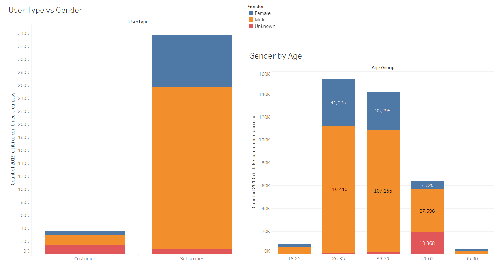
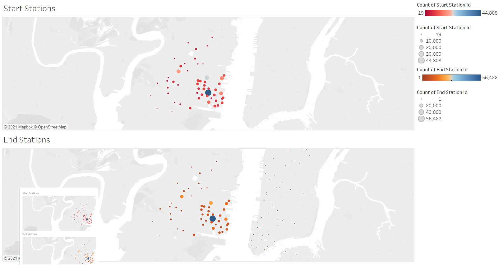
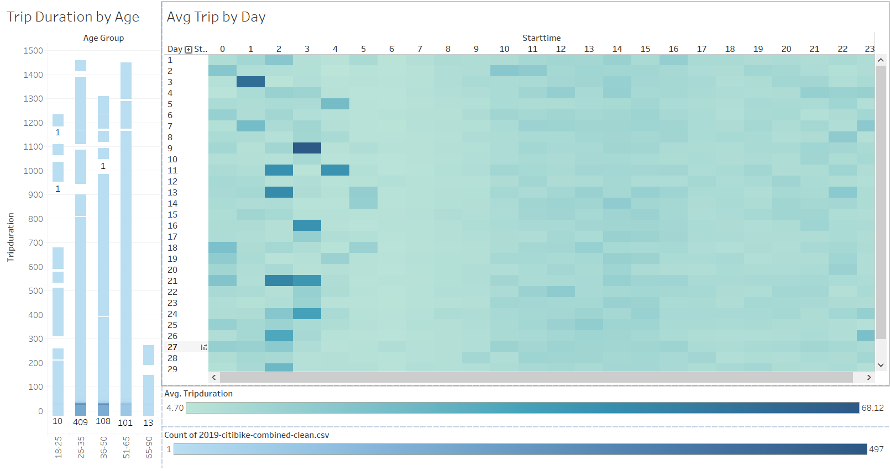

# Tableau Homework - Citi Bike Analytics

## Background

Congratulations on your new job! As the new lead analyst for the [New York Citi Bike](https://en.wikipedia.org/wiki/Citi_Bike) Program, you are now responsible for overseeing the largest bike sharing program in the United States. In your new role, you will be expected to generate regular reports for city officials looking to publicize and improve the city program.

Since 2013, the Citi Bike Program has implemented a robust infrastructure for collecting data on the program's utilization. Through the team's efforts, each month bike data is collected, organized, and made public on the [Citi Bike Data](https://www.citibikenyc.com/system-data) webpage.

However, while the data has been regularly updated, the team has yet to implement a dashboard or sophisticated reporting process. City officials have a number of questions on the program, so your first task on the job is to build a set of data reports to provide the answers.

## Data

**I reviewed the Citibike data and selected 2019 as the time frame I wanted to analyze.** 

**I pulled down the CSV files for each month and then used pandas to combine them into one dataframe and export to a combined CSV file.** 

**I took the combined CSV to Tableau for some data visualizations.**

## Visualizations

* I reviewed the user type (Customer, Subscriber) by Gender.

* I looked at Gender by my Age Brackets (18-25, 26-35, 36-50, 51-65, 65-90) and displayed that on a Gender Dashboard.

* I displayed the Riders by Month as a Story.

* I mapped out the starting stations as well as the ending stations and placed those worksheets on a Stations Dashboard.

* I calculated the Number of Trips by Month.

* I created a square chart with the average trip duration by day by hour.

* I displayed trip duration by age and then added it to a Trip Dashboard along with the Avg Trip by Day.

